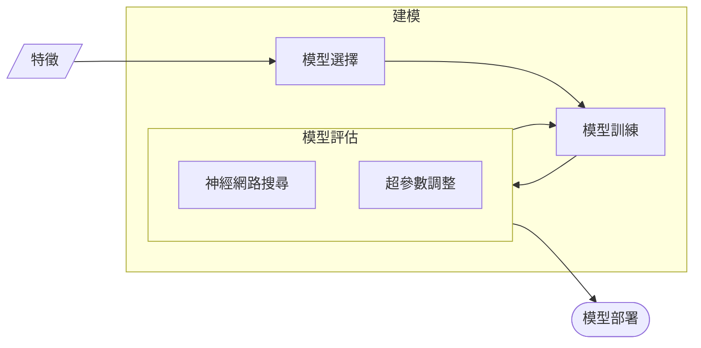
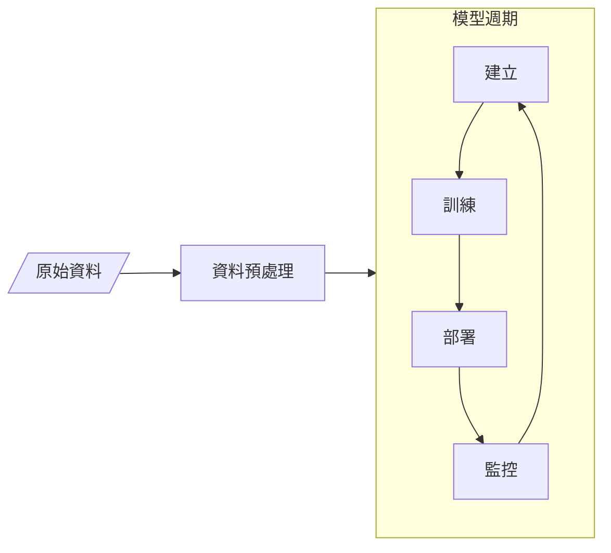

本系列是這本書「[AutoML 自動化機器學習：用 AutoKeras 超輕鬆打造高效能 AI 模型](https://www.books.com.tw/products/0010911296)」的學習筆記，並融入了我所補充整理的額外資料。

本篇主要是介紹機器學習的工作流程，包含資料擷取、資料預處理、 模型選擇、模型訓練、模型評估及調整、模型部署及模型監控，並介紹 AutoML 基本概念。

<!-- more -->

AutoML 雖然名稱上是 ML，不過因為 DL 是 ML 中的一個子領域，而且目前 DL 已成為目前 AI 的主流，因此 DL 幾乎已成為 ML 的代名詞，而本書所提到的 ML 也都是以 DL 為主。

我整理了一張心智圖，幫助大家釐清人工智慧大框架下各種技術之間的關係，而這也是我目前對機器學習、深度學習、監督式學習、非監督式學習等技術的理解。(<i class="fa-solid fa-fire fa-bounce" style="color: #0091ff;"></i>持續更新)。
<iframe width="768" height="432" src="https://miro.com/app/live-embed/uXjVK5KS9og=/?moveToViewport=1632,443,1675,1746&embedId=43613898587" frameborder="0" scrolling="no" allow="fullscreen; clipboard-read; clipboard-write" allowfullscreen></iframe>

這本書的目標對象是:
1. 具備基本的 Python 程式基礎
2. 各種程度的 ML 及 DL 學習者
3. 想實際在專案中運用自動化機器學習技術
4. 想找 AutoML 雲端服務以外的替代品

# ML 面臨的挑戰
在正式進入 AutoML 介紹前，先來談談目前 ML 面臨的挑戰。
1. 80% 時間在進行資料預處理。
   
2. 正確選擇模型以及調整超參數，非常耗時與佔用機器資源。
    - 沒有任何的演算法模型是可以保證在所有的資料集中表現最好，因此挑選一個好的演算法是自動化機器學習的首要任務。
    - 許多模型往往依賴於超參數，透過不同的超參數設定可以取得更好的學習結果。
    - `random_state=42` 就是一個magic number。~~(因為，它只是生命、宇宙、一切的答案。)~~
3. 持續監控模型結果。
4. 持續搜尋新資料以便重新訓練模型。
5. AI 專案需要跨專業合作的團隊，資料科學家不是唯一最重要的角色。
    - 資料科學家的產業知識深度比不上領域專家。
    - AI 專案需要跨專業合作的團隊，資料科學家不是唯一最重要的角色。
    - ~~這樣的團隊組成就像是超能特攻隊般的存在~~。
    - ~~可能也找不到一個擁有所有技能的獨角獸通~~。
   
    

        (資料來源: 
        <a href="https://www.perform-global.com/blog/ai-to-success-3-foundation#%e4%ba%8c%e3%80%81%e5%b0%8e%e5%85%a5-ai-%e7%9a%84%e5%9f%ba%e6%9c%ac%e6%a2%9d%e4%bb%b6%e8%88%87%e5%9f%ba%e6%9c%ac%e5%8a%9f-data" style="color: #555; text-decoration: none;">
            最新調查｜台灣企業 AI 成熟度現況與導入 AI 三大基本面)
        </a>
    

# ML 工作流程的介紹
> Machine Learning is not just about building model.


flowchart LR
    A[資料擷取] --> B[資料預處理]
    B --> C[模型選擇]
    C --> D[模型訓練]
    D --> E[模型評估 模型調整]
    E --> F[模型部署]
    F --> G[模型監控]
    E --> D


## 資料擷取(Data Ingestion)
機器學習工作流程的第一步是搜集和導入外部資料。當我們希望透過機器學習技術來解決問題時，資料的品質對於模型的預測結果有著至關重要的影響。高品質的資料能夠提供準確且可靠的模型預測。

## 資料預處理(Data Preprocessing)
機器學習工作流程的第二步是資料預處理，也是最花時間的步驟之一。根據 The Economist [這篇](https://www.economist.com/technology-quarterly/2020/06/11/for-ai-data-are-harder-to-come-by-than-you-think)報導，有 80% 時間在進行資料預處理。(~~我以為我在做 AI，但原來我在做資料清理~~)。

### 資料清洗(Data Cleaning)
通常包含填補缺失值、處理異常值、移除重複值、雜訊等。
- 填補缺失值：使用平均值、中位數、眾數或插值法等方式填補缺失的數據。
- 處理異常值：識別並處理離群值，避免其對模型訓練結果的影響。
- 移除重複值：刪除資料集中的重複記錄，確保資料的唯一性。
- 處理雜訊：清理包含錯誤、亂碼或特殊符號的數據，確保資料的質量。

### 特徵萃取(Feature Extraction)
特徵萃取是將原始數據中的重要信息提取出來的過程。
- 篩選特徵：在不損失有用信息的前提下，去除冗餘或不相關的特徵。
- 特徵合併與重整：將相關特徵合併或重構，減少特徵空間的維度，從而降低計算資源消耗。


特徵是資料集中每個欄位的數據，代表了數據的不同屬性，通常我們會說==特徵(feature)或 x==。而標籤是我們希望預測的結果，就是模型訓練的目標，通常我們會說==標籤(label)或 y==。
- 特徵(Feature): 自變量(Independent Variable)、輸入(Input)、預測變量(Predictor Variable)、解釋變量(Explanatory Variable)。
- 標籤(Label): 目標(Target)、因變量(Dependent Variable)、輸出(Output)、響應變量(Response Variable)、結果(Outcome)、真實值(Ground Truth)。


對於模型的訓練和預測來說，每個特徵都是一個重要的變數。模型會試著替每個變數找出權重(weight)，與預測結果越有關係的特徵就會獲得越大的權重，進而能找出最佳的預測結果。權重反映了特徵對預測結果的影響力。通過調整這些權重，模型可以逐步提高預測的準確性和精度。


### 特徵選取(Feature Selection)
特徵選取是在選擇專案真正需要的特徵，移除冗餘或不太相關的特徵資料。特徵數量過多時，需要構建更大型的神經網路，這不僅會增加計算資源的需求，還容易導致訓練過程中的過擬合 (overfitting)。


過擬合(overfitting)指的是模型在訓練集上的表現非常好，但在處理未見過的新資料(比如測試集)時，預測效果卻很差的情況。


### 特徵工程(Feature Enginerring)
特徵工程包括多個步驟，不同資料來源對特徵工程分類方式解釋就有所不同，但我看到得資料通常也涵蓋「特徵萃取」和「特徵選取」，有時甚至包括「資料清洗」在內。在此，先根據作者的分類方式說明。特徵工程是基於領域知識，運用資料探勘技巧，來將原始資料中隱藏的資訊轉換/萃取為新特徵的過程。

### 資料隔離(Data Segregation)
將資料集分成2份:
- 訓練資料集(Train Dataset): 訓練模型的資料集。
- 測試資料集(Test Dataset): 測試模型訓練成效的資料集。

資料預處理完成後，就會進入建模(Modeling)。這個流程會不斷迭代，並需要測試多種不同的模型，直接找到最有效的一種。建模包含模型選擇、模型訓練、模型評估、模型調整。

## 模型選擇(Model Selection)
選擇模型時主要考量以下幾點:
- 可解釋性
  - 如何明確模型的決策依據?了解模型是如何做出決策。
- 易於除錯: 當出現錯誤時，我們該如何進行修正?
- 資料集的類型: 這會決定適合使用哪種模型。
- 資料集的大小
  - 可取得的資料量?未來是否會變化?
  - 大型資料集可能需要較為強大的模型與更多計算資源。
- 資源需求: 有多少硬體資源和時間可以進行訓練與預測。

## 模型訓練(Model Training)
將經過資料預處理後的訓練資料集傳入各個候選模型中，讓模型可以利用反向傳播演算法(backpropagation)從中學習，在樣本中尋找模式(pattern)。


反向傳播演算法(backpropagation)是指，當神經網路模型在訓練時，資料會以「前向傳播」通過各層神經節點，並計算出一個預測值。該值與訓練資料的實際值之誤差，則會被反向傳給模型的各個節點，此稱為反向傳播，以便更新權重，使其更有機會產生更小的誤差、更準確的預測。


## 模型評估(Model Evaluation)
使用測試資料集來衡量模型預測的準確度。

常用效能衡量指標:
- 分類模型: ==分類是觀察預測值和實際值的正確程度==。常用的是預測準確率(Accuracy)、精確率(Precision)、召回率(Recall)或 F1 Score。而關於機器學習分類模型中常見的的效能衡量指標，請看 [看了就被混淆的混淆矩陣及相關效能衡量指標](https://estellacoding.github.io/blog/confusion-matrix-acc-ppv-tpr-f1-score/) 這篇文章。
- 迴歸模型: ==迴歸是觀察預測值和實際值的差距==。常用的是均方誤差(MSE)、均方根誤差(RMSE)、平均絕對誤差(MAE)和決定係數($ R^2 $)。而關於機器學習迴歸模型中常見的的效能衡量指標，請看 [機器學習中迴歸模型的效能衡量指標](https://estellacoding.github.io/blog/regression-metrics-mse-rmse-mae-r2/) 這篇文章。

## 模型調整(Model Turning)
若模型的訓練表現不理想，可調整超參數來重新訓練，例如學習率(learning rate)、模型使用的最佳化演算法(optimization algorithm)、神經網路的層數和各層的運算方法等。


學習率(learning rate)是指模型的學習效率，數值越高表示模型更新幅度越劇烈。學習率過低時，模型收斂緩慢，需花費較長時間進行，也可能陷入局部最佳解而無法繼續最佳化；而學習率過高時，則可能造成更新過快，錯過最佳解位置且無法收斂。


## 模型部署(Model Deployment)
選出最佳模型正式上線，並採用 API 服務的形式來供使用者或其他內部服務取用。

## 模型監控(Model Monitoring)
監控模型在真實世界的表現，並依此來進行調校。

### 為何要監控模型?

以搜尋引擎的使用者為例，一個預測模型會依據使用者特徵，如個人資訊、搜尋類型、點擊紀錄，來決定要顯示的廣告。然而經過一段時間，這些舊的搜尋紀錄可能就無法反映近期的搜尋行為。

所以對抗模型漂移(model drift)的辦法，就是持續監控模型，確保其預測能力沒有下降，並決定何時或如何重新訓練模型。


模型漂移(model drift)指的是隨著時間推移，模型的預測表現會逐漸變差的現象。


### 如何監控模型?
如果做完預測後可馬上得到正確答案，那你只要監控常見的效能衡量指標，如預測準確率(Accuracy) 或 F1 Score。

真實結果的取得經常跟預測結果有一段時間差。例如，在預測電子郵件是否為垃圾信的情形中，使用者可能在過幾個月後才把該信標註為垃圾郵件，此時你就需要用到其他衡量方式。

### 該監控模型哪些項目?
- 模型本身: 監控目前選用的模型類型、採用的架構、最佳化演算法及超參數設定。
- 輸入資料分佈: 比較訓練資料與目前輸入資料，以確認訓練資料是否能夠反映真實世界的現況。
- 部署日期: 記錄模型發佈的日期。
- 使用變數: 監控模型所使用的輸入變數。有時正式環境使用到某些資料特徵，但並未在模型採用。
- 期望與實際差異: 如用散佈圖比較預期結果與實際結果，以識別模型預測的準確性。
- 發佈次數: 監控模型被發佈的次數，通常用模型版本號碼來表示。
- 運作時間: 記錄模型部署至今所經過的時間。

# 什麼是 AutoML
AutoML，也稱自動化機器學習，就是一個自動化過程，將上述提到的 ML 工作流程中的每個步驟，從資料預處理到 ML 模型的部署，都以 AI 演算法來自動處理。

# AutoML 的自動化項目

一般著重的還是以下最耗時的項目:
- 自動化特徵工程
- 自動化模型種類選擇與超參數調整
- 自動化神經網路架構選擇
- 自動化資料預處理

## 自動化特徵工程
自動化特徵工程能夠不斷產生新的特徵組合，直到 ML 模型獲得良好的預測表現。

## 自動化模型種類選擇與超參數調整
每一種模型都有適合處理的問題種類，若使用自動化模型選擇，我們就可以針對特定的任務找出所有合適的模型，再從中選擇最準確的。

怎麼替模型找出最佳超參數?
- 網格搜尋(Grid Search)
- 隨機搜尋(Random Search)
- 貝氏搜尋(Bayesian Search)
- Hyperband 搜尋

## 自動化神經網路架構選擇
設計神經網路架構，即自訂調整神經網路的各層組成方式，是 ML 中最複雜又冗長的任務之一。

在2010年代中期，有人提出利用演化演算法和強化學習來尋找最佳神經網路架構的搜尋方法，稱作神經網路架構搜索(Neural Architecture Search, NAS)。

以下列出 NAS 引用次數最多的著作:
- NASNet : Learning Transferable Architecture for Scalable Image Recognition
- AmoebaNet : Regularized Evolution for Image Classifier Architecture Search
- ENAS : Efficient Neural Architecture Search

## 自動化資料預處理
將資料傳入給神經網路模型之前，我們通常會做資料預處理的方法，如特徵工程、資料正規化、資料向量化以及缺值處理，以提升模型的學習表現。
- 特徵工程: **在深度學習中，神經網路可以自動從原始輸入資料萃取出相關的特徵**。
  - 利用人類專家的專業知識，從原始資料中提取適當的特徵，藉此提升模型的表現。
  - 有些情況下還是會手動進行特徵工程，例如我們沒有足夠大的資料集，或輸入資料為非結構化的，或者我們的運算資源有限。
- 資料正規化(normalization): **把數值縮放到 0~1 之間稱為正規化**。
  - 因為神經網路模型的學習演算法是依據梯度來更新權重參數，所以在處理較小的輸入數值時表現較好，這類數值通常介於 0 到 1 之間。
  - AutoKeras 的許多模型其實會自動執行這個步驟，在 [AutoKeras 訓練 MNIST 的圖像分類器和迴歸器 - Hello MNIST: 圖像分類器](https://estellacoding.github.io/blog/autokeras-mnist/#Hello-MNIST-%E5%9C%96%E5%83%8F%E5%88%86%E9%A1%9E%E5%99%A8) 文章中，我們使用的 MNIST 資料集，其中像素值是 0~255 的整數，我們沒有進行正規化就輸入模型，因為 AutoKeras 已經自行替我們處理這部分了。~~(自動正規化真香)~~
- 資料向量化(vectorization): **將資料轉為張量(Tensor)**。
  - 在 [什麼是張量(Tensor)?](https://estellacoding.github.io/blog/what-is-tensor) 文章中提到，神經網路使用的資料是張量(Tensor)形式。資料向量化就是將資料轉為張量，此處理過程將原始輸入資料轉為浮點數向量，更適合演算法進行學習。
  - AutoKeras 能夠使用多種方式達成資料向量化。
- 資料編碼(encoding): **文字轉換為對應的數值**。
  - 有些資料是以文字表示的分類資料(例如四季、正或負)，非連續數值，這些資料必須先轉換為對應的數值，如 0,1,2,3...，才能讓模型用於訓練。
  - AutoKeras 在處理結構化資料時，會自動對分類資料做編碼。~~(自動編碼真香)~~
- 缺值處理: **常見的做法是以 0 填補缺值**。
  - 在深度學習模型中，常見的做法是以 0 填補缺值，這也是 AutoKeras 處理缺值的標準做法，因為 0 本身就已經是不顯著的值。一旦神經網路模型學習到 0 代表缺值之後便會忽略它。
  - 務必注意的是，如果資料集會以特殊方式(例如文字)表示缺值，那麼你得事先手動轉換或移除它，因為模型並不曉得這些資料不具意義。

# AutoML 工具
以下列出 AutoML 常見的工具。
- AutoKeras
- auto-sklearn
- DataRobot
- Darwin
- H20-DriverlessAl
- Google Cloud AutoML
- Amazon SageMaker Autopilot
- Microsoft Azure Machine Learning
- Tree-based Pipeline Optimization Tool(TPOP)
- Fast and Lightweight AutoML(FLAML)

透過 Towards Automated Machine Learning: Evaluation and Comparison of AutoML Approaches and Tools [這篇](https://arxiv.org/abs/1908.05557)論文可以看到對主流 AutoML 工具的詳盡比較，並得出以下結論: 
> 主流的商業解決方案如 H2O-DriverlessAl、DataRobot 以及 Darwin，可以讓我們解讀資料綱要、執行特徵工程，並產生詳細的分析結果來供人解讀，至於開源的工具則更強調建模、訓練跟模型評估的自動化，將其他資料層面的任務留給資料科學家進行。

    (資料來源: 
    <a href="https://arxiv.org/abs/1908.05557" style="color: #555; text-decoration: none;">
        Fig. 2. Comparison table of functionality for AutoML tools.)
    </a>

# 總結
說明 ML 工作流程的不同階段，包含資料擷取、資料預處理、 模型選擇、模型訓練、模型評估及調整、模型部署及模型監控。在傳統 ML 流程中，資料科學家會花費大量時間在不同階段，因而促使自動化機器學習(AutoML)的誕生。

介紹 AutoML 基本概念，包含超參數最佳化及最佳神經網路架構的搜尋方法。而關於如何安裝 AutoKeras，並怎麼用 AutoKeras 來訓練一個簡單的神經網路，請看 [AutoKeras 訓練 MNIST 的圖像分類器和迴歸器](https://estellacoding.github.io/blog/autokeras-mnist) 這篇文章。