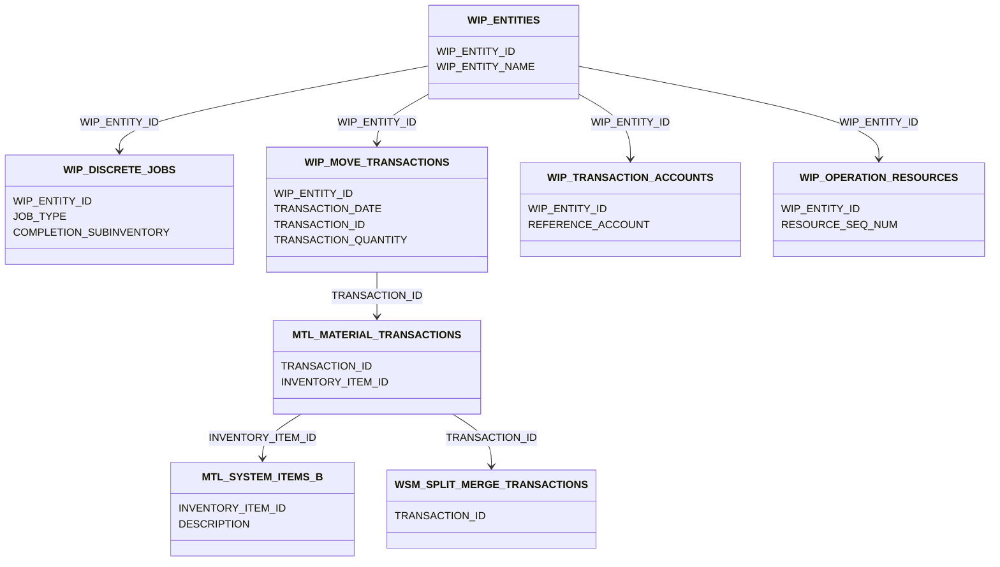

將完整展示如何透過 GitHub Copilot 自動解析 SQL JOIN 語法，逐步生成專業的 UML 圖表流程。從環境建置到最終視覺化呈現，帶大家再次體驗 AI 輔助開發的高效工作流。

<!-- more -->

# 安裝套件
關於如何安裝套件的方式，請看 [【GitHub Copilot】用 VS Code 解鎖 AI 寫扣超能力 - Mermaid](https://estellacoding.github.io/blog/github-copilot-vscode-ai-coding/#Mermaid)。

# 準備SQL
以製造業 ERP 系統的 Shop Floor Management 模組為例，設計一個多表連接查詢。(~~專治表格設計架構都不清楚就要上場寫SQL的小苦手~~)

這張報表需求是要查詢 WIP 工單進度、成本核算，以及生產交易記錄。
- WIP 工單追蹤報表 – 顯示工單進度、物料流動情況。
- WIP 成本核算報表 – 彙總工單對應的會計科目。
- 生產交易記錄報表 – 查詢所有 WIP 交易記錄。

```
SELECT 
  we.WIP_ENTITY_ID,
  we.WIP_ENTITY_NAME,
  wd.JOB_TYPE,
  wd.COMPLETION_SUBINVENTORY,
  wm.TRANSACTION_DATE,
  wm.TRANSACTION_ID,
  mm.INVENTORY_ITEM_ID,
  ms.DESCRIPTION AS ITEM_DESCRIPTION,
  wm.TRANSACTION_QUANTITY,
  wta.REFERENCE_ACCOUNT AS ACCOUNT_ID,
  wor.RESOURCE_SEQ_NUM AS RESOURCE_SEQ
FROM WIP_ENTITIES we
JOIN WIP_DISCRETE_JOBS wd ON we.WIP_ENTITY_ID = wd.WIP_ENTITY_ID
JOIN WIP_MOVE_TRANSACTIONS wm ON we.WIP_ENTITY_ID = wm.WIP_ENTITY_ID
JOIN MTL_MATERIAL_TRANSACTIONS mm ON wm.TRANSACTION_ID = mm.TRANSACTION_ID
JOIN MTL_SYSTEM_ITEMS_B ms ON mm.INVENTORY_ITEM_ID = ms.INVENTORY_ITEM_ID
JOIN WSM_SPLIT_MERGE_TRANSACTIONS wsm ON mm.TRANSACTION_ID = wsm.TRANSACTION_ID
JOIN WIP_TRANSACTION_ACCOUNTS wta ON we.WIP_ENTITY_ID = wta.WIP_ENTITY_ID
JOIN WIP_OPERATION_RESOURCES wor ON we.WIP_ENTITY_ID = wor.WIP_ENTITY_ID
```

<div style="margin-top: -15px; margin-bottom: 10px; font-size: 14px; color: #555; text-align: center; font-style: normal; font-family: 'Arial', sans-serif;">
    (資料來源: <a href="https://www.triniti.com/shop-floor-management-er-diagram" style="color: #555; text-decoration: none;">Shop Floor Management ER Diagram)
    </a>
</div>

# Copilot Edits

使用套件 vscode-mermAId 來自動生成 UML，記得要將sql檔案加入提示詞中。

```
@mermAId /uml 請根據所有的JOIN仔細畫出每個表的關聯的UML圖
```


點擊View Markdown Source，可以看到 Copilot 幫我們生成的 Markdown 語法囉。


# 生成UML
生成的 Markdown 語法的 UML 後，即可在支援 Markdown 的平台上呈現。

(~~每次看還是會想wow一下XD~~)


# 結論
透過 GitHub Copilot 自動化解析與 vscode-mermAId 插件，讓我們能將複雜的 SQL JOIN 關係快速轉換為視覺化 UML 圖表，特別適合在以下情境:
- 幫助成員快速理解系統架構。
- 分析資料庫結構變更的潛在影響。
- 強化技術文件的視覺化表達。