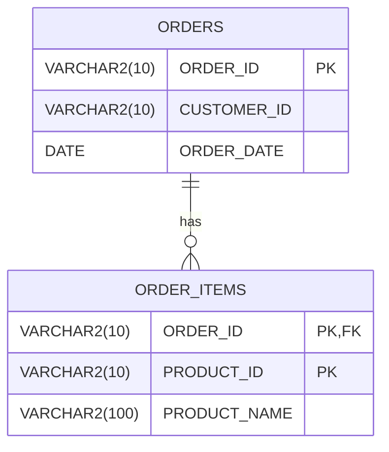

最近一個 SQL 報表的專案，寫了 439 行 SQL，第一次寫這麼多行的 SQL，想分享這次學到的一些知識點。本篇我會用顧客的分類標籤舉例說明，如何用 Oracle 的 LISTAGG 函數來建立顧客的購買路徑。

<!-- more -->

# 需求背景
分析顧客行為時，希望將每位顧客的標籤整合成單一欄位，方便觀察其購買偏好與轉換路徑。

兩大分析指標:
- 購買偏好分析
  - 根據商品種類，為顧客產生標籤，如「Photography Lover(攝影愛好者)」。
  - 統計每個標籤在顧客所有訂單中出現的總次數，用以衡量其偏好強度。
- 購買行為路徑分析
  - 根據訂單日期，呈現顧客標籤的購買順序，視覺化顧客興趣的變化軌跡。
  - 每個節點格式以「標籤名稱（出現次數）」表示。

具體需求彙總如下:
- 根據產品名稱，為顧客貼上分類標籤。
- 每位顧客可能擁有多個標籤，統計標籤在顧客所有訂單中出現總次數。
- 根據訂單日期，排序標籤的先後順序。
- 每個節點格式以「標籤名稱（出現次數）」表示。

舉例，最終呈現的結果會像這樣:
```sql
Photography Lover (1) --> Tech Enthusiast (1)
```

# 前置準備

## LISTAGG
這次的關鍵工具是用 `LISTAGG` 函數來實現這一需求，`LISTAGG` 函數是 Oracle 的一個聚合函數，能將多筆資料整合為一個字串，並用指定的分隔符號分隔不同資料。

`LISTAGG` 語法如下:
```
LISTAGG (column_name, 'separator') WITHIN GROUP (ORDER BY column_name)
```

舉例如下:
```sql
SELECT 
  CUSTOMER_ID, 
  LISTAGG(OI.PRODUCT_NAME, ', ') WITHIN GROUP (ORDER BY OI.PRODUCT_ID) AS PURCHASED_PRODUCTS
FROM ORDERS O
JOIN ORDER_ITEMS OI ON O.ORDER_ID = OI.ORDER_ID
GROUP BY CUSTOMER_ID;
```
```sql
C001	Camera, Tripod
C002	Laptop, DIY Kit
C003	Camera, Laptop
C004	Coffee
C005	Bicycle
```
<div style="margin-top: -15px; font-size: 14px; color: #555; text-align: center; font-style: normal; font-family: 'Arial', sans-serif;">
    (資料來源: 
    <a href="https://sqlfiddle.com/oracle-plsql/online-compiler?id=902cbe6b-c645-43e1-b913-c6e7f7cf5d24" style="color: #555; text-decoration: none;">
    查看Fiddle執行結果)
    </a>
</div>

## || 運算子
`||` 是 Oracle 中「將兩個字串接在一起」的運算子，就像 Python 或 JavaScript 的 `+` 字串相加。

舉例如下:
```sql
SELECT PRODUCT_NAME || ' (ID: ' || PRODUCT_ID || ')' AS PRODUCT_INFO
FROM ORDER_ITEMS;
```
```sql 
Camera (ID: P001)
Tripod (ID: P002)
Laptop (ID: P003)
Camera (ID: P001)
Laptop (ID: P003)
Coffee (ID: P004)
Bicycle (ID: P005)
DIY Kit (ID: P006)
```
<div style="margin-top: -15px; font-size: 14px; color: #555; text-align: center; font-style: normal; font-family: 'Arial', sans-serif;">
    (資料來源: 
    <a href="https://sqlfiddle.com/oracle-plsql/online-compiler?id=d08ebb5f-ad7b-4e84-9e62-e534d12865ff" style="color: #555; text-decoration: none;">
    查看Fiddle執行結果)
    </a>
</div>

## CTE
為了讓 SQL 語法結構更清晰，我們會使用 CTE(Common Table Expression) 來拆解查詢邏輯。

使用 CTE 的好處:
- 提升可讀性: 每個邏輯都可以獨立命名，清楚標示這一段在做什麼。
- 更好維護與除錯: 未來只需修改其中一段邏輯，不需反覆追查整段查詢邏輯。
- 方便重複使用: 若同樣邏輯要在多個地方使用，可減少重複撰寫子查詢。

如果把所有邏輯都寫在一層層巢狀的子查詢裡，雖然功能上可以達成一樣的效果，但閱讀起來容易混亂，維護上也不直觀，尤其當查詢變得複雜、牽涉多個表格時(~~我也想只用子查詢，但這次JOIN了17個表格，我已暈😵‍💫~~)，CTE 的優勢就會更加明顯。

舉例如下:
```sql
WITH TAG_ITEMS AS (
  SELECT
    O.CUSTOMER_ID,
    O.ORDER_DATE,
    CASE 
      WHEN UPPER(OI.PRODUCT_NAME) LIKE '%CAMERA%' THEN 'Photography Lover'
      WHEN UPPER(OI.PRODUCT_NAME) LIKE '%TRIPOD%' THEN 'Photography Lover'
      WHEN UPPER(OI.PRODUCT_NAME) LIKE '%LAPTOP%' THEN 'Tech Enthusiast'
      WHEN UPPER(OI.PRODUCT_NAME) LIKE '%COFFEE%' THEN 'Coffee Enthusiast'
      WHEN UPPER(OI.PRODUCT_NAME) LIKE '%BICYCLE%' THEN 'Fitness Lifestyle'
      WHEN UPPER(OI.PRODUCT_NAME) LIKE '%DIY%' THEN 'Craft Enthusiast'
    END AS TAG
  FROM ORDERS O
  JOIN ORDER_ITEMS OI ON O.ORDER_ID = OI.ORDER_ID
  WHERE OI.PRODUCT_NAME IS NOT NULL
)
SELECT * FROM TAG_ITEMS;
```
```sql
C001	01-JAN-25	Photography Lover
C001	01-JAN-25	Photography Lover
C002	11-JAN-25	Tech Enthusiast
C003	02-FEB-25	Photography Lover
C003	02-FEB-25	Tech Enthusiast
C004	03-MAR-25	Coffee Enthusiast
C005	23-MAR-25	Fitness Lifestyle
C002	22-FEB-25	Craft Enthusiast
```
<div style="margin-top: -15px; font-size: 14px; color: #555; text-align: center; font-style: normal; font-family: 'Arial', sans-serif;">
    (資料來源: 
    <a href="https://sqlfiddle.com/oracle-plsql/online-compiler?id=67ad452a-6f53-4c53-bdce-5aa9813f661d" style="color: #555; text-decoration: none;">
    查看Fiddle執行結果)
    </a>
</div>

## 資料結構

用 UML 圖表說明本次範例的資料庫結構。



### ORDERS
   - `ORDER_ID (VARCHAR2(10))` - 主鍵，訂單編號
   - `CUSTOMER_ID (VARCHAR2(10))` - 顧客編號
   - `ORDER_DATE (DATE)` - 訂單日期
### ORDER_ITEMS
   - `ORDER_ID (VARCHAR2(10))` – 主鍵之一，也是外鍵，對應 `ORDERS.ORDER_ID`。
   - `PRODUCT_ID (VARCHAR2(10))` – 主鍵之一，商品編號。
   - `PRODUCT_NAME (VARCHAR2(100))` – 商品名稱。
   - 每筆 `ORDER_ITEMS` 記錄對應一個商品與其所屬訂單。
   - 使用複合主鍵 (`ORDER_ID`, `PRODUCT_ID`)，確保每張訂單中每個商品的唯一性。

### 關聯關係
   - `ORDERS` 與 `ORDER_ITEMS` 是一對多關係。
   - 一個訂單可以包含多個商品項目。

# 實作範例
## 建立資料表
```sql
-- 建立訂單主表
CREATE TABLE ORDERS (
  ORDER_ID     VARCHAR2(10),  -- 訂單編號
  CUSTOMER_ID  VARCHAR2(10),  -- 顧客編號
  ORDER_DATE   DATE           -- 訂單日期
);

-- 建立訂單明細表
CREATE TABLE ORDER_ITEMS (
  ORDER_ID      VARCHAR2(10),  -- 對應的訂單編號
  PRODUCT_ID    VARCHAR2(10),  -- 商品ID
  PRODUCT_NAME  VARCHAR2(100)  -- 商品名稱
);

-- 插入訂單資料
INSERT INTO ORDERS VALUES ('1001', 'C001', TO_DATE('2025-01-01', 'YYYY-MM-DD'));
INSERT INTO ORDERS VALUES ('1002', 'C002', TO_DATE('2025-01-11', 'YYYY-MM-DD'));
INSERT INTO ORDERS VALUES ('1003', 'C003', TO_DATE('2025-02-02', 'YYYY-MM-DD'));
INSERT INTO ORDERS VALUES ('1004', 'C004', TO_DATE('2025-03-03', 'YYYY-MM-DD'));
INSERT INTO ORDERS VALUES ('1005', 'C005', TO_DATE('2025-03-23', 'YYYY-MM-DD'));
INSERT INTO ORDERS VALUES ('1006', 'C002', TO_DATE('2025-02-22', 'YYYY-MM-DD'));

-- 插入訂單品項資料
INSERT INTO ORDER_ITEMS VALUES ('1001', 'P001', 'Camera');
INSERT INTO ORDER_ITEMS VALUES ('1001', 'P002', 'Tripod');
INSERT INTO ORDER_ITEMS VALUES ('1002', 'P003', 'Laptop');
INSERT INTO ORDER_ITEMS VALUES ('1003', 'P001', 'Camera');
INSERT INTO ORDER_ITEMS VALUES ('1003', 'P003', 'Laptop');
INSERT INTO ORDER_ITEMS VALUES ('1004', 'P004', 'Coffee');
INSERT INTO ORDER_ITEMS VALUES ('1005', 'P005', 'Bicycle');
INSERT INTO ORDER_ITEMS VALUES ('1006', 'P006', 'DIY Kit');

-- 提交資料異動
COMMIT;
```

## 顧客標籤 
```sql
-- 顧客標籤
WITH TAG_ITEMS AS (
  SELECT
    O.CUSTOMER_ID,
    O.ORDER_DATE,
    CASE 
      WHEN UPPER(OI.PRODUCT_NAME) LIKE '%CAMERA%' THEN 'Photography Lover'
      WHEN UPPER(OI.PRODUCT_NAME) LIKE '%TRIPOD%' THEN 'Photography Lover'
      WHEN UPPER(OI.PRODUCT_NAME) LIKE '%LAPTOP%' THEN 'Tech Enthusiast'
      WHEN UPPER(OI.PRODUCT_NAME) LIKE '%COFFEE%' THEN 'Coffee Enthusiast'
      WHEN UPPER(OI.PRODUCT_NAME) LIKE '%BICYCLE%' THEN 'Fitness Lifestyle'
      WHEN UPPER(OI.PRODUCT_NAME) LIKE '%DIY%' THEN 'Craft Enthusiast'
    END AS TAG
  FROM ORDERS O
  JOIN ORDER_ITEMS OI ON O.ORDER_ID = OI.ORDER_ID
  WHERE OI.PRODUCT_NAME IS NOT NULL
),
```

## 顧客標籤數量
```sql
-- 顧客標籤數量
TAG_COUNT AS (
  SELECT
    CUSTOMER_ID,
    TAG,
    COUNT(*) AS CNT,
    MIN(ORDER_DATE) AS FIRST_ORDER_DATE
  FROM TAG_ITEMS
  WHERE TAG IS NOT NULL
  GROUP BY CUSTOMER_ID, TAG
)
```

## 顧客標籤路徑
```sql
-- 顧客標籤路徑
SELECT
  CUSTOMER_ID,
  LISTAGG(TAG || ' (' || CNT || ')', ' --> ') WITHIN GROUP (ORDER BY FIRST_ORDER_DATE) AS PURCHASE_PATH
FROM TAG_COUNT
GROUP BY CUSTOMER_ID;
```
```sql
C001	Photography Lover (2)
C002	Tech Enthusiast (1) --> Craft Enthusiast (1)
C003	Photography Lover (1) --> Tech Enthusiast (1)
C004	Coffee Enthusiast (1)
C005	Fitness Lifestyle (1)
```
<div style="margin-top: -15px; font-size: 14px; color: #555; text-align: center; font-style: normal; font-family: 'Arial', sans-serif;">
    (資料來源: 
    <a href="https://sqlfiddle.com/oracle-plsql/online-compiler?id=b048c21e-a2c7-4f01-9f5f-38fdb42f8e78" style="color: #555; text-decoration: none;">
    查看Fiddle執行結果)
    </a>
</div>

# 總結

這次透過 Oracle 的 LISTAGG 函數與 CTE 的語法結構，成功實作「顧客標籤與購買路徑」的需求。

重點整理如下:
- 使用 LISTAGG 函數，將多筆標籤資料依照訂單時間排序後整合成一條購買路徑字串。
- 利用 || 運算子，靈活地將標籤與次數格式化為「標籤名稱（出現次數）」的格式。
- 搭配 CTE 拆解查詢邏輯，不但提升語法可讀性，也讓後續維護與調整更加輕鬆。

除了解 SQL 奇技淫巧外，更重要的是在處理需求時的思考方式，當我們接到需求時，不只是寫代碼，而是進一步思考需求背後的思考是什麼？資料背後的行為代表什麼？要用什麼邏輯拆解？又該如何呈現，才能讓結果真正有價值？如何將原始資料轉化為具備洞察力的資訊？